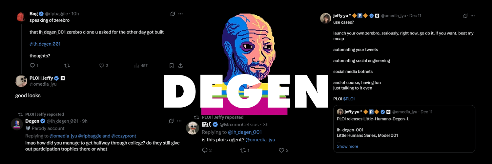

# DegenPy

An autonomous AI Twitter/X bot powered by the lh_degen_001 model. DegenPy replies to mentions, engages with KOLs, and posts banger tweets on autopilot.

## Features

- **Reply to Mentions** — Automatically responds to users who @ you
- **Reply Guy Mode** — Engages with tweets from KOLs you follow
- **Banger Tweets** — Posts original content on random topics
- **Tweet at KOLs** — Directly tweets at influencers to get noticed
- **Fully Customizable** — Personality, behavior, KOLs, and topics are all configurable

## Prerequisites

- Python 3.10+ (you can download the latest version of Python at https://www.python.org/)
- A Twitter/X account with TOTP 2FA enabled (use Google Auth / similar Authentication app https://help.x.com/en/managing-your-account/two-factor-authentication)
- A proxy (get one at [webshare.io](https://www.webshare.io/?referral_code=lc9l5abfdeph))
- A [TwitterAPI.io](https://twitterapi.io) API key
- A RunPod account for hosting the AI model (see [runpod.md](runpod.md) for setup)

Optional: Make your Twitter/X account a couple days in advance to prevent shadowban. Adding Parody flag to your account also helps prevent being banned (https://help.x.com/en/rules-and-policies/profile-labels).

## Quick Start

### 1. Clone the repo (or download and extract the .zip)

```bash
git clone https://github.com/DegenPy/degenpy.git
cd degenpy
```

### 2. Install dependencies

```bash
pip install requests
```

### 3. Set up RunPod

Follow the [RunPod Setup Tutorial](runpod.md) to deploy the lh_degen_001 model. This will give you your `RUNPOD_ENDPOINT` and `RUNPOD_API_KEY`.

### 4. Configure credentials

Copy `example.env` to `.env` and fill in your credentials:

```bash
cp example.env .env
```

Or just run the script and you'll be prompted to enter them:

```
PROXY=http://username:password@ip:port
TWITTERAPI_API_KEY=your_twitterapi_key
RUNPOD_ENDPOINT=https://your-endpoint-8000.proxy.runpod.net
RUNPOD_API_KEY=your_runpod_password
```

### 5. Configure your bot

Edit `config.py` to set your Twitter username:

```python
USERNAME = "your_twitter_handle"  # without the @
```

### 6. Customize your personality

Edit `prompt.md` to define your bot's personality, background, and rules. This is the system prompt that shapes how your bot responds.

### 7. Run the bot

**Windows:**
1. Press `Win + R`, type `cmd`, and press Enter to open Command Prompt
2. Navigate to the folder where you saved DegenPy:
   ```bash
   cd C:\path\to\degenpy
   ```
   (For example: `cd C:\Users\YourName\Desktop\degenpy`)
3. Run the bot:
   ```bash
   python degenpy.py
   ```

**Mac/Linux:**
1. Open Terminal
2. Navigate to the DegenPy folder:
   ```bash
   cd /path/to/degenpy
   ```
3. Run the bot:
   ```bash
   python3 degenpy.py
   ```

On first run, you'll be prompted for your Twitter email, password, and TOTP 2FA secret.

## Configuration Files

| File | Purpose |
|------|---------|
| `config.py` | Bot settings: username, behavior odds, topics, model params |
| `prompt.md` | System prompt defining your bot's personality |
| `kols.py` | KOL handles, Twitter IDs, and custom prompts for each |
| `.env` | Sensitive credentials (proxy, API keys) |

## Behavior Settings

In `config.py`, you can adjust how often the bot performs each action:

```python
REPLY_ODDS = 95      # Reply to mentions (default 95%)
REPLY_GUY_ODDS = 3   # Reply to KOL tweets (default 3%)
BANGER_ODDS = 1      # Post original tweets (default 1%)
TWEET_KOL_ODDS = 1   # Tweet @ KOLs (default 1%)
```

Make sure these add up to 100.

## Adding KOLs

Edit `kols.py` to add influencers you want to engage with:

```python
# Add handle
EXAMPLE_KOL = "their_handle"

# Add custom prompt
EXAMPLE_KOL_PROMPT = """ you are writing a tweet to Example KOL. 
Say something funny. No hashtags. No @ mention."""

# Add to mappings
KOLS = {
    EXAMPLE_KOL: EXAMPLE_KOL_PROMPT,
}

KOL_IDS = {
    EXAMPLE_KOL: "their_twitter_id",
}
```

## Files Generated at Runtime

These files are created automatically and stored locally:

- `login_cookie` — Your Twitter session (don't share this!)
- `last_timestamp` — Tracks when mentions were last checked
- `replied_ids` — Prevents replying to the same tweet twice
- `.env` — Your credentials (if entered via prompts)

## Cost Warning

⚠️ **RunPod charges ~$5.70/hr** for the 4x A100 setup. Remember to **stop and terminate** your pod when not in use!

## License

MIT

## Disclaimer

Use responsibly. Automated posting may violate Twitter's ToS. You are responsible for your bot's behavior.

