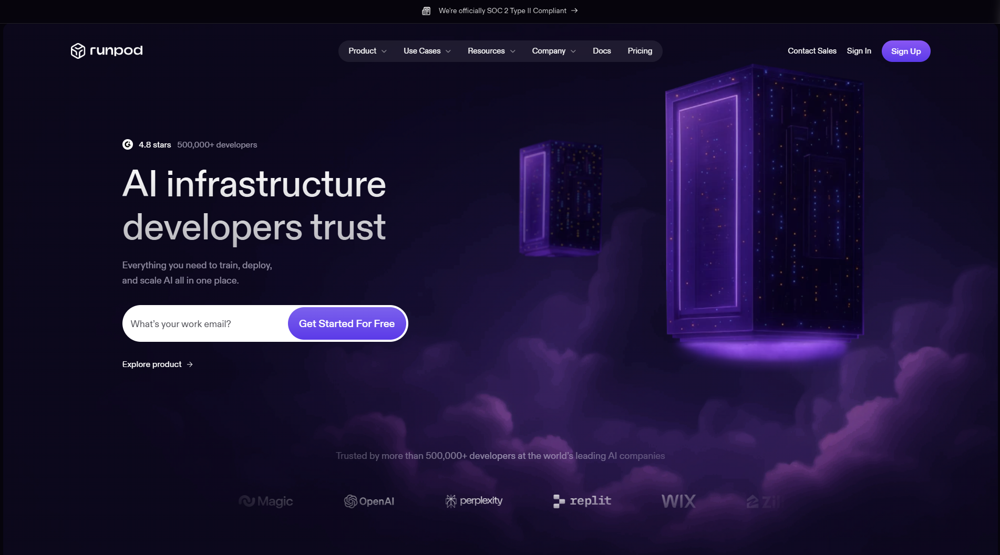
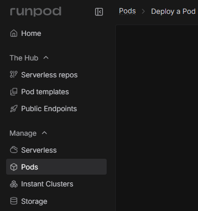
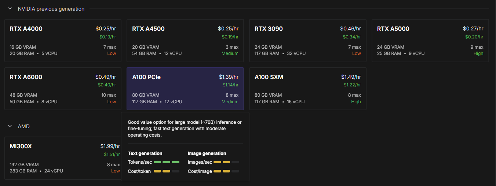
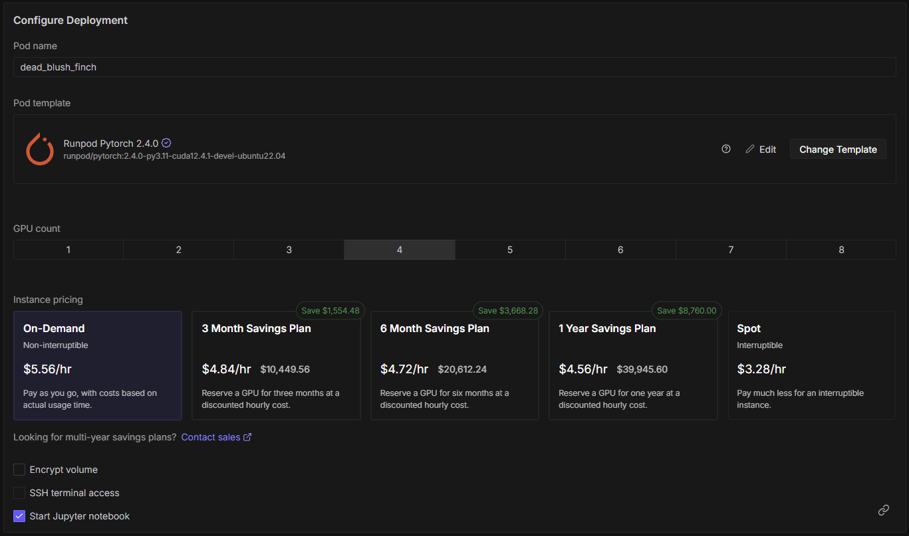
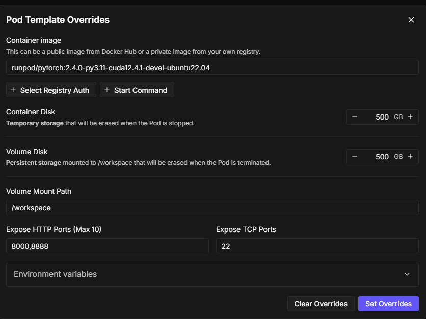
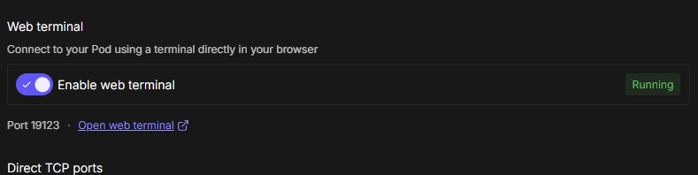
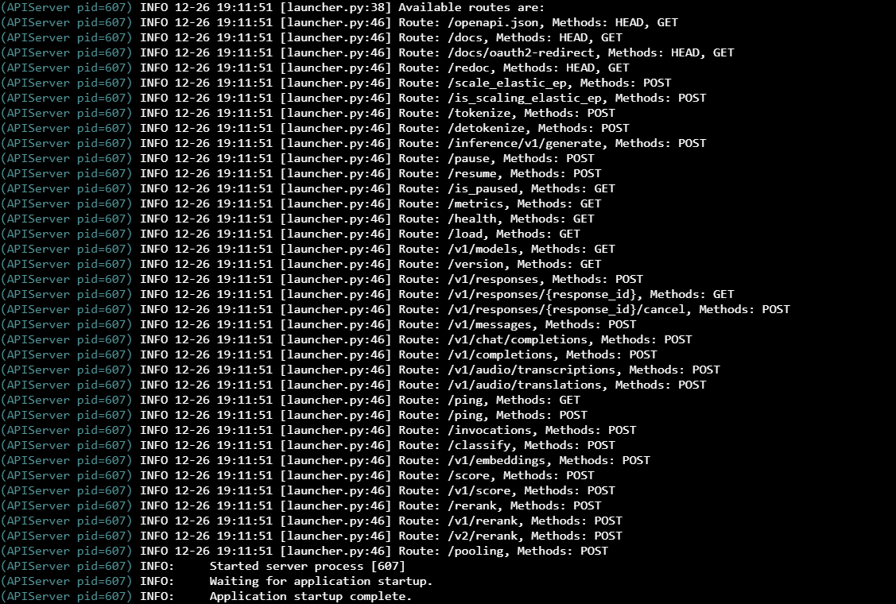
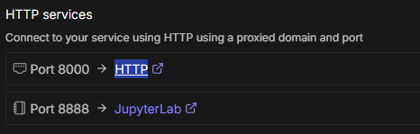

# RunPod Setup Tutorial for lh_degen_001

This guide will walk you through setting up a RunPod instance to host the lh_degen_001 model using vLLM.

---

## Step 1: Create a RunPod Account



Go to [https://www.runpod.io/](https://www.runpod.io/) and create an account. Add some balance to your account. **At least $10 is recommended for testing.**

---

## Step 2: Navigate to Pods



After setting up your account, click on **"Pods"** in the left-hand navigation bar.

---

## Step 3: Select GPU Type



Scroll down and choose **A100 PCIe** as your GPU type.

---

## Step 4: Configure GPU Count and Edit Template



1. Set **GPU count to 4**
2. Click **"Edit"** under the Pod Template (next to the "Change Template" button)

---

## Step 5: Configure Storage and Ports



In the Pod Template Overrides:
- Set **Container Disk** to **500 GB**
- Set **Volume Disk** to **500 GB**
- Under **Expose HTTP Ports**, add **8000** (you should have both **8000** and **8888** exposed)

Click **"Set Overrides"** to save.

---

## Step 6: Deploy the Pod



Click **"Deploy On-Demand"** and your Pod will start being built. It should say "Waiting for connection data".

Once it finishes loading, click **"Enable web terminal"** and open the web terminal.

---

## Step 7: Install vLLM and Start the Server



When the terminal opens, run these 3 commands:

### Command 1: Install vLLM

```bash
pip install vllm --break-system-packages
```

### Command 2: Start the vLLM Server

```bash
nohup vllm serve PLOI-Labs/lh-degen-001 \
  --tensor-parallel-size 4 \
  --max-model-len 8192 \
  --api-key {PASSWORD} > vllm.log 2>&1 &
```

> ⚠️ **IMPORTANT:** Replace `{PASSWORD}` with a valid alphanumeric string (e.g., `bn7c3pB7nw8B6CM`) and save this value — you'll need to add it to `config.py` as `RUNPOD_API_KEY`.

### Command 3: Monitor the Logs

```bash
tail -f vllm.log
```

vLLM will take a while to start up and download the lh_degen_001 model. **It might seem frozen or not doing anything, but be patient** — it takes a long time to download a merged model of this size.

You'll know it's done when you see:
```
INFO:     Application startup complete.
```

If you get disconnected from the web terminal, you can bring the log file back up with:
```bash
tail -f vllm.log
```

> 💰 **COST WARNING:** You will be charged **~$5.70/hr** while your RunPod instance is running. When you are done using/testing your Degen model, hit **Stop** and then **Terminate** on your Pod in the Pod settings to prevent running up a bill.

---

## Step 8: Get Your RunPod Endpoint



1. Go back to the **"My Pods"** menu on RunPod (click "Pods" in the left navigation menu)
2. Under **HTTP services**, click the purple **"HTTP"** link next to **"Port 8000"**
3. This will give you your `RUNPOD_ENDPOINT` to paste into `config.py`

Your endpoint should look like:
```
https://abcd1234-8000.proxy.runpod.net
```

> ⚠️ **IMPORTANT:** Do NOT put a `/` at the end of the URL. Make sure it ends with just `.net`

---

## Done!

Now you have your RunPod vLLM hosting set up for Degen. Update your `config.py` with:
- `RUNPOD_ENDPOINT` — the URL from Step 8
- `RUNPOD_API_KEY` — the password you set in Step 7
